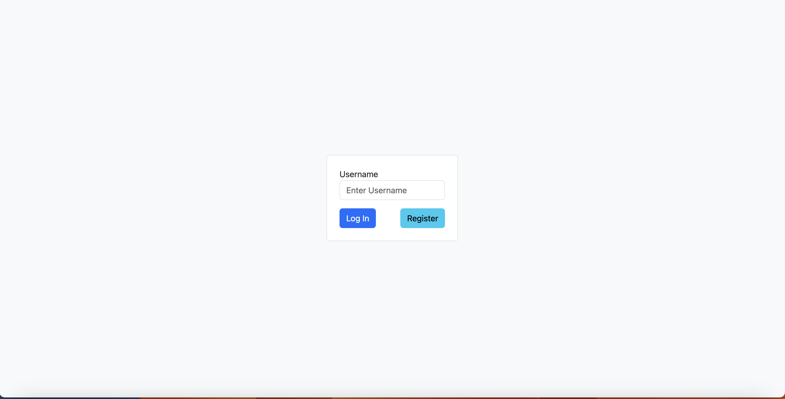
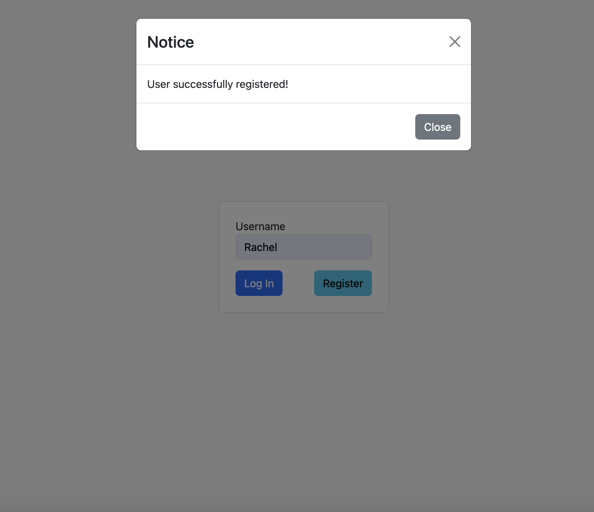
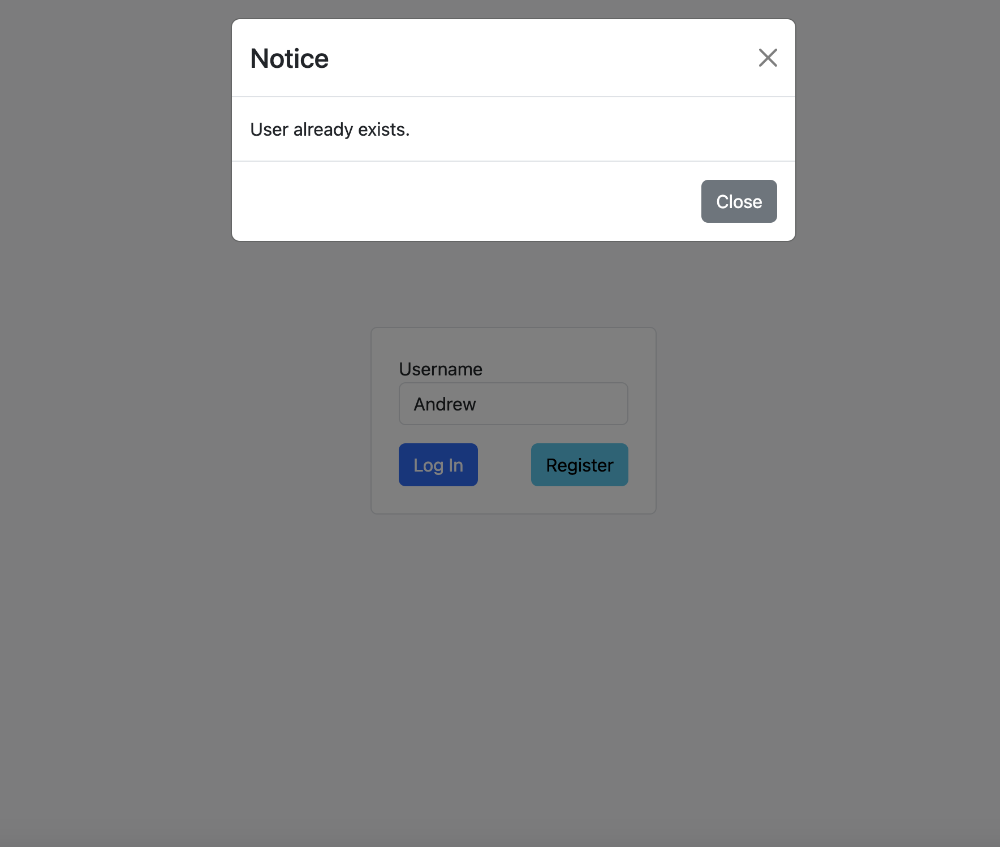
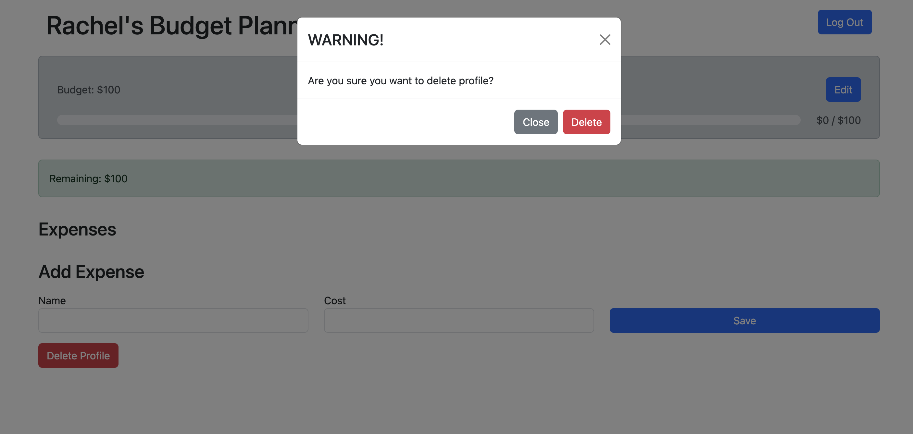

# Overview
A budget tracker that can support multiple users with their own separate expenses. Completed by utilizing React, Node.js, Express.js and mySQL.

## Example
The login screen is simple.

Failed login:

Upon successful registration:

Upon trying to register a user that already exists:

Example Budget Page:

Deleting a user:

## Future Plans
Am planning to add the ability to group expenses into categories, along with password capabilities for users. Will also improve the UI.

### Mentions
This project was bootstrapped with [Create React App](https://github.com/facebook/create-react-app).

